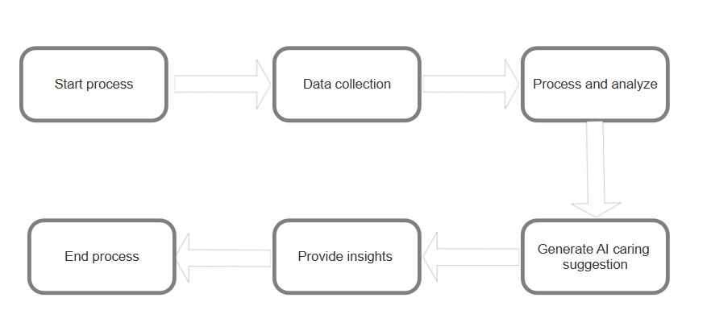

## Mental health monitoring AI
This project is about implementing a pet AI which understands the human feelings and emotions by their own and gives suggestions and relaxing messages based on our data.
## Brief Intro
Developing a mental health monitoring system integrated with AI. It is a virtual pet AI which tracks and monitors the user's daily activities like eating food, water monitoring, step count, sleep monitoring etc. It will analyse the user's actions and emotions by interacting with the user's emotional state.
## Workflow diagram

## App features
<ul>
<li>Emotional Tracking and Analysis</li>
<li>Personalized Feedback and Support</li>
<li>Activity and Routine Monitoring</li>
<li>Health Monitoring</li>
<li>Social Interaction Insights</li>
<li> Productivity and Time Management Support</li>
<li> Daily Reflection and Goal Setting</li>
<li> Mindfulness and Relaxation Exercises</li>
<li> Personalized Pet Interactions</li> 
<li>Customizable User Experience</li> 
</ul>

## Novelty
<ul>
  <li>
1. Emotion-Driven Nurturing:  
   - This platform uniquely integrates with the user’s emotional state directly into the growth and well-being of the virtual assistant. It offers a highly personalized and unique experience. Unlike other apps, this connection turns emotional care into a meaningful interaction.</li>
<li>
2. Bidirectional Impact:  
   - This system establishes a positive feedback between the user and the virtual assistant, the user’s mood directly influences the pet's well-being and caring for the companion improves the user’s mental health.</li>
<li>
3. Personalized AI Dynamics:  
   - The platform adapts to the user's unique emotional patterns and behaviour.</li>
<li>
4. Mental Health Gamification:  
   -This platform transforms emotional regulation into a fun, engaging, and rewarding activity, making it more accessible and effective.</li>
<li>
5. Data-Driven Insights:  
   - The platform collects and analyzes a person's mood and behavioral offering personalized insights to help users better understand their emotions and mechanisms. </li>
<li>
6. Dynamic Feedback System:  
   - It provides real-time responses to the user’s emotional state by adapting its behavior, appearance, and communication to create a free unique experience .</li>
  <li>
7. Customizable Companions:  
   - Users can design their virtual pets like appearance, personality, and preferences. </li>
<li>
8. Emotion-Aware Interactions:  
   - Using Advanced emotional recognition Technology it detects subtle changes in the user’s mood through journaling, voice inputs, or daily check-ins.</li></ul>

## Tech Stack 
<li>1. Front-End Development</li>
<ul>
  <li>UI Design:Figma or Adobe XD (for design and prototyping)</li>
<li>HTML</li>
<li>CSS</li>
<li>JavaScript</li>
</li>
  </ul>
<li>2. Back-End Development</li>
<ul>
  <li>Django/Flask (Python frameworks)</li>
  </ul>
<li>3. Voice and Text Interaction</li>
<ul>
  <li>TensorFlow or PyTorch </li>
  </ul>
<li>4.Code Editor</li>
<ul>
<li>
  Visual Studio Code (VS Code)
</li>

## Solution
<li>Creating a web-based interactive platform that simulates virtual animals to raise awareness about mental health and provide users with a positive and fun environment. The platform will allow users to configure their pets by entering information such as their name, age, gender, sleep duration, and activity level. It will also provide thought-based ideas and animations to create a human-like environment for mental training.</li>
<ul>
  <li>
    Objective:
Develop a lightweight web application using Flask that serves as a virtual pet companion. The pet interacts with users based on their input and promotes self-care through real-time insights.
  </li>
  <li>
    Simplicity: A user-friendly interface ensures that all age groups can easily interact with the application.</li>
  <li>
Accessibility: Responsive design for use on desktops, tablets, and mobile devices.</li>
<li> Customization: Personalized pet profiles and engaging animations create a sense of ownership and connection.
  </li>
</ul>
                   

